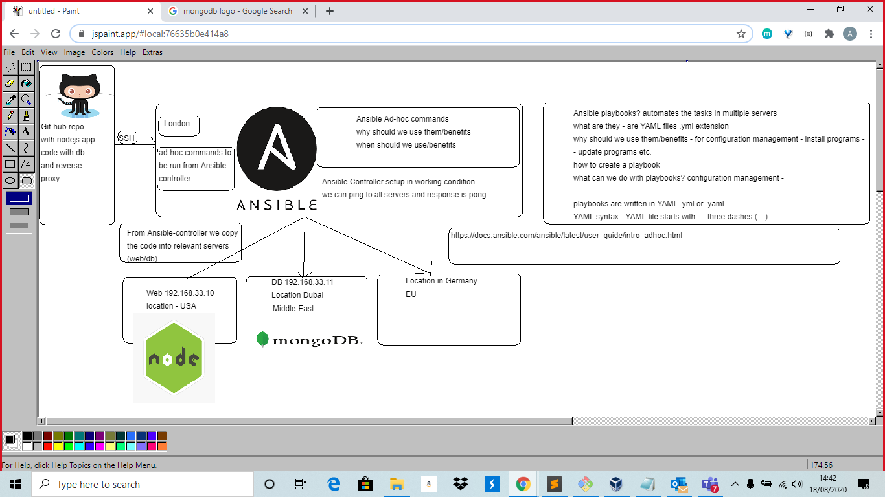

# What is Ansible?

    Ansible is an open-source, configuration management tool to provision IT environments, deploy software or be integrated to CI/CD pipelines.
    
    Ansible helps improve the scalability, consistency and reliability of your IT environment
    
    Ansible can automate repetitive system administration tasks
    
    Ansible uses SSH to push changes from a single source to multiple remote resources

# What does open-source mean?
    Software that is designed to be publicly accessible
    Anyone can see, modify, and distribute the code as they see fit.

# What can Ansible automate?
    Provisioning: Set up various servers (e.g Nginx web server) you need in your infrastructure
    
    Configuration management: Changes the configuration of an application, OS, or device; start and stop services; install or update applications; implement a security policy; or perform a wide variety of other configuration tasks.
    
    Application deployment: Make DevOps easier by automating the deployment of internally developed applications to your production systems.
    
    Security and Compliance:
    https://www.edureka.co/blog/what-is-ansible/

# Why Ansible?
    Simplicity
    Ansible uses YAML, a simple configuration language rather than Ruby which Puppet and Chef use.
    Ansible deployment is also agentless, meaning instead of installing an agent on every system you want to manage, Ansible just requires that systems have Python (on Linux servers) or PowerShell (on Window servers) and SSH
    
    Agentless means Ansible works by connecting to our virtual machines through SSH (by default).
    Ansible is a helpful tool that allows you to create multiple virtual machines and describe how these machines should be configured or what actions should be taken on them.
    Ansible issues all commands from a central location to perform these tasks.
    
    No other client software is installed and uses SSH to connect to the nodes.
    Only Ansible needs to be installed on the control machine (the machine from which you will be running commnads)
    
    It is efficient: No extra software, more resources for your applications. Ansible modules work via JSON, therefore Ansible is extensible with modules written in a programming language you're already familiar with.
    Cost effective: by building consistent ephemeral environments for staging, tests, or QA.

# What is YAML?
    Human-readable data serialisation language
    Simple syntax, stands for Yet Another Markup Language

# What does agentless mean?
    Refers to operations where no service, daemon or process needs to run in the background on the machine.
    Agentless doesn't require any agent to be installed for monitoring.
    
    You don't need to install software or firewall ports on the nodes that it manages.
    E.g you don't need to install Python, because it's already pre-installed in our Virtual Machine.
    No need to install dependencies

# What is Configuration Management?
    Chef, Puppet
    They help configure the software and systems on this infrastructure that has already been provisioned.
    It maintains configuration of the product performance by keeping a record and updating detailed information which describes an enterprise's hardware and software.

# What is Infrastructure as Code?
    Type of IT setup wherein developers or operations team automatically manage and provision technology stack for an application through software e.g. Ansible, rather than using a manual process to configure hardware devices and operating systems.
    Process of managing and provisioning computer data centers through machine-readable definition files e.g YAML or Ruby, rather than physical hardware configuration.
    Process of automating your infrastructure deployments

# Infrastructure as Code tools
    Terraform
    Provisioning tool
    Allows you to describe your infrastructure as code and creates 'execution plans' that outline exactly what will happen when you run your code.

# How does Ansible fit into DevOps?
    Extracted from TechBeacon
    Simple IT automation, automating repeatable tasks like provisioning, configuration, and deployments for one machine or millions.
    Accelerates feedback loop
    Discover bugs sooner

# More reliable deployments
    Ansible is agentless meaning no additional software or firewall ports are required and you do not have to separately set up a management infrastructure which includes managing your entire systems, network and storage.
    Ansible further reduces the effort required for your team to start automating right away.
    Ansible isn't just about automation. IaC requires DevOps practices to automation scrips to ensure they're free of errors, are able to be redeployed on multiple servers and can be rolled back in case of problems, and can be engaged by both operations and development teams.

# Best practices of IaC:
    1.Managing infrastructure via source control, providing a detailed audit trail for changes. 
    2.Applying testing to infrastructure in the form of unit testing, functional testing, and integration testing. 
    3.Avoid written documentation, since the code itself will document the state of the machine. This is particularly powerful because it means, for the first time, that infrastructure documentation is always up to date. 
    4.Enables collaboration around infrastructure configuration and provisioning, most notably between dev and ops.

# Ansible Ad-Hoc Commands

An Ansible ad-hoc command uses the /usr/bin/ansible command-line tool to automate a single task on one or more managed nodes. 
Ad-hoc commands are quick and easy, but they are not reusable. 

Get the current date of a VM 
    
    ansible web -a "date"
Ip address of all machines
    
    ansible all -m shell -a "ifconfig"
Name of os running on the system
    
    ansible db -a "uname -a"
lists all file within the database
    
    ansible all -m shell -a "ls -a"

Show how much free space is on the VM's
    
    ansible all -m shell -a "free"

ad-hoc command to find out up-time
    
    ansible all -m shell -a 'uptime' --become
    
how much disk space is on the VM's 
    
    ansible all -a "df -h"
    
IP add of the VM
    
    ansible db -m shell -a "hostname -I"
    
Uptime of all machines
    
    ansible all -m shell -a uptime
    
To see all the environment variables in the Vm's 
    
    ansible all -m shell -a env

To see all running processes on the VM's
    
    ansible all -m shell -a "ps -aux"

ansible-playbook 

# Playbooks

written in YAML

allow you to provision multiple servers :

- 192.168.33.10 - web

- 192.168.33.11 - db

- 192.168.33.12 - aws

